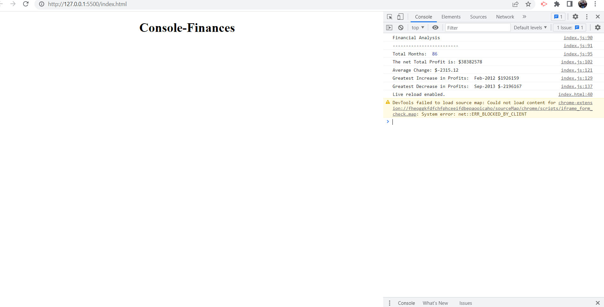

# Console-Finances

## Description: 
This Repository has the real world problem solved using JavaScript. 
It also utilizes variable, for- loops, math, multidimentional Arrays.

## Task: 
-- Create a Code to analyze the financial records of a company from a given Dataset.
-- The total number of months included in the dataset.
-- The net total amount of Profit/Losses over the entire period.
-- The average of the changes in Profit/Losses over the entire period.
-- The greatest increase in profits (date and amount) over the entire period.
-- The greatest decrease in losses (date and amount) over the entire period.
  
  Print the analyzed data to console.

  ## Screenshot: 
  

  ## Submission: 

  ### Deployed application URL:https://vinita686.github.io/Console-Finances/ 
  ### GitHub Repo URL: https://github.com/Vinita686/Console-Finances